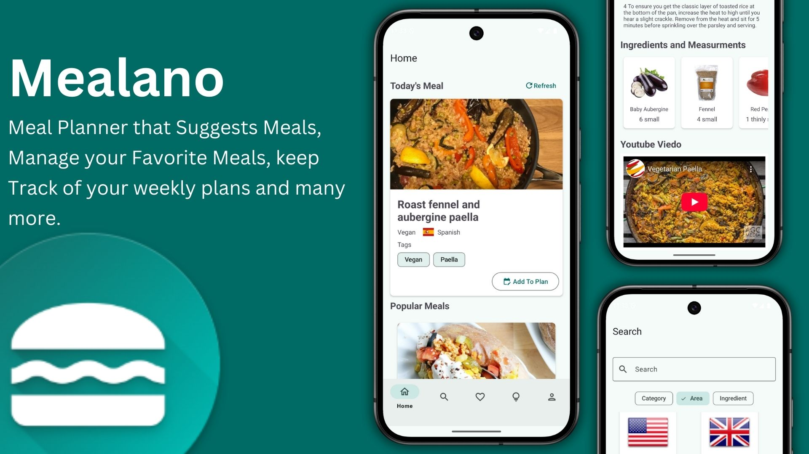
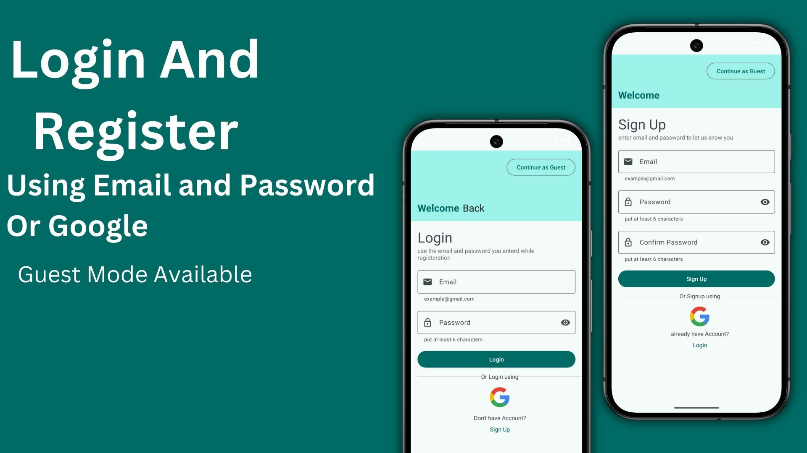
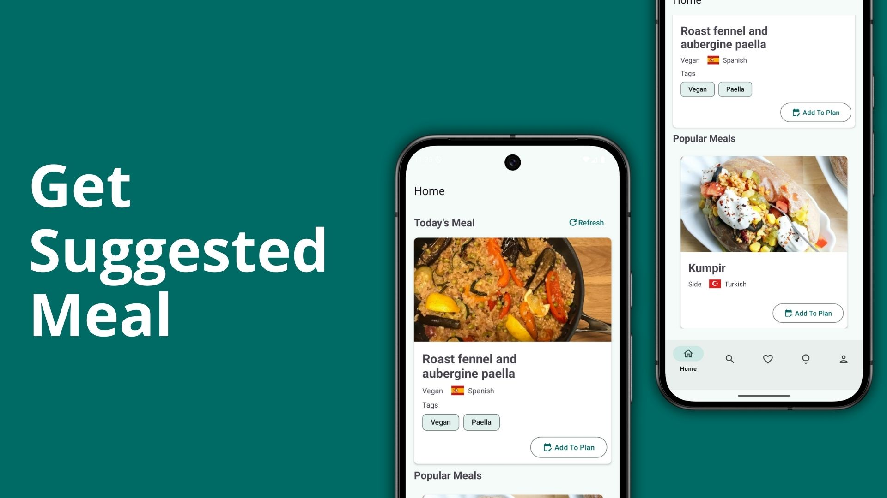
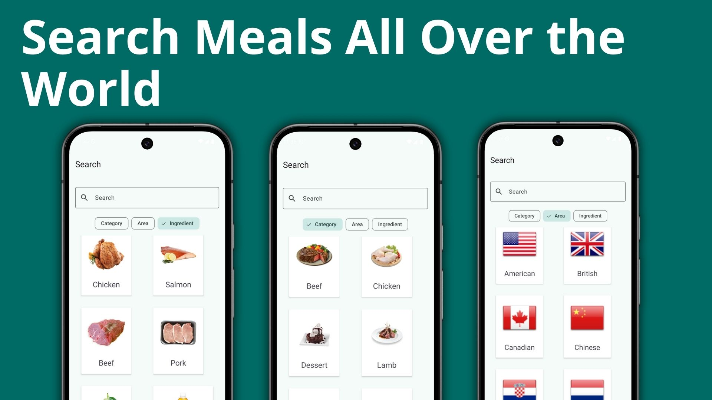
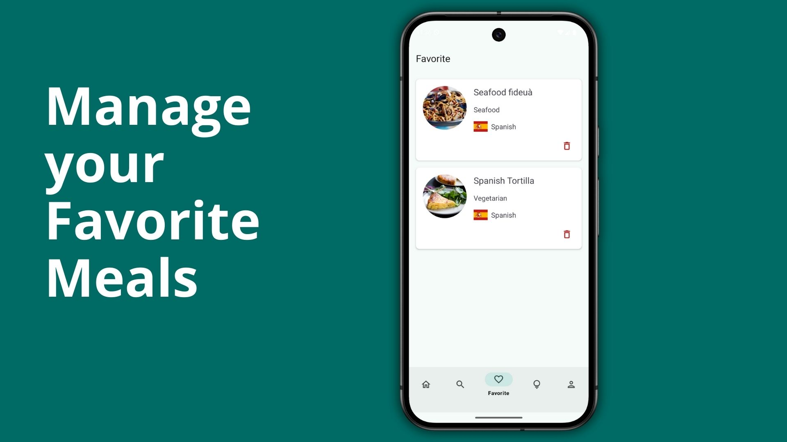
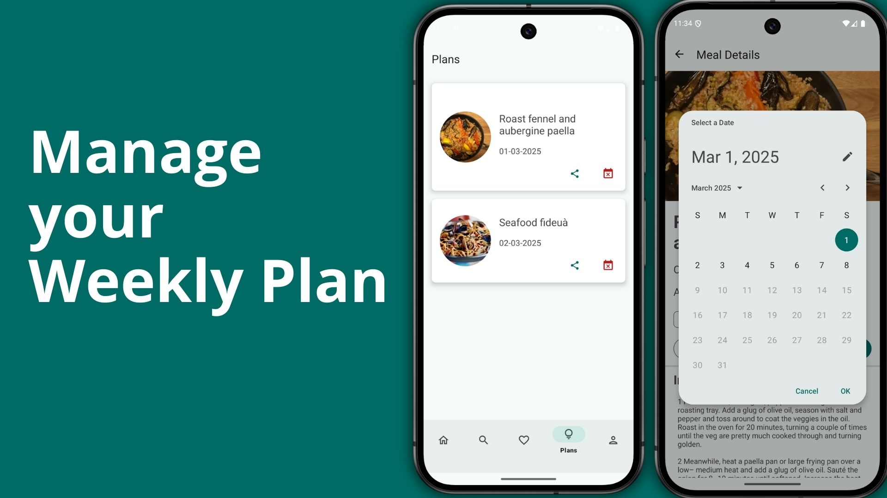
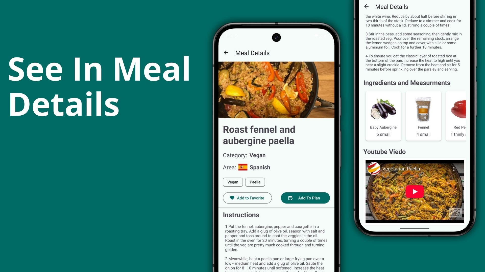
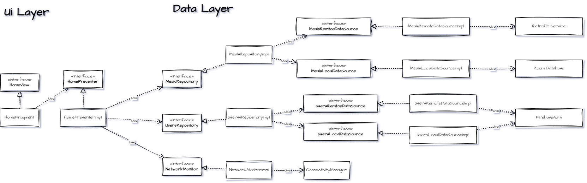

# Mealano



## Overview

Meal Planner is an Android application built using Java that helps users plan their meals efficiently. It provides features such as meal suggestions, searching by various criteria, favorite meal management, and integration with the mobile calendar.

## Features

### Version 1.0.0

- Support for Dark/Light Modes
- Supoort for Arabic/English
  

#### 🚀 **User Authentication**

- **Login Screen**
    - Login using Email and Password
    - Login using Google
- **Signup Screen**
    - Signup using Email and Password
    - Signup using Google

#### 🎉 **User Experience**

- **Splash Screen**
- **Onboarding Screens** (Displayed only on first installation)

#### 🍽️ **Meal Management**

- **Home Screen**
  
    - Suggested Meal for the Day
    - List of Popular Meals
    - Add Meals to Plans
- **Search Meals Screen**
 

    - Search by Ingredient
    - Search by Area
    - Search by Category
- **Favorite Meals Screen**
  
    - View Favorite Meals
    - Remove Meals from Favorites
- **Plans Screen**
  
    - View and Manage Meal Plans
    - Delete Meal Plans
    - Share Meal Plans with Mobile Calendar
- **Details Screen**
  
  - view meal Details
  - view list of ingredients 
  - view steps to make the Meal
  - Youtube video for the recipe

#### 👤 **User Profile & App Information**

- **Profile Screen**
    - Logout from the app
    - View App Information
- **About Screen**
    - A personal message from the developer

## 📌 Installation

1. Clone the repository:
   ```sh
   git clone https://github.com/Boodyahmedhamdy/Mealano.git
   ```
2. Open the project in Android Studio.
3. Build and run the application on an emulator or physical device.

## 🛠️ Tech Stack

- **Language:** Java
- **Architecture:** MVP (Model-View-Presenter)
- **Database:** RoomDatabase, Firebase Realtime Database
- **Networking:** Retrofit
- **Reactive Programming:** RxJava
- **UI Framework:** XML-based UI, Material Design Components
- **Authentication:** Firebase Authentication

## 📷 Other Developers

For developers interested in understanding the architecture of the application, refer to the images below:

this is a high level view for the Home Screen Feature. most of datalayer elements are reusable. so don't get confused



## 📬 Contact

For any inquiries or suggestions, feel free to reach out!

---

📌 *Developed with ❤️ by Abdelrahman Ahmed Hamdy*

